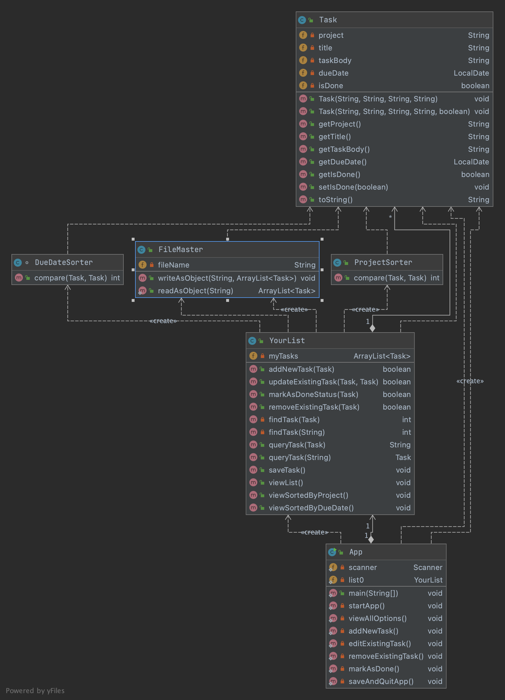

# AwesomeToDoLyOnGradle
This application is a simple text based user interface representing a to-do list, in which a user can create, edit, remove, mark as done and save tasks.
### @Author: Lubov Novozhilova

## Getting started
This application can be run directly via Gradle or via a generated jar file.

### Run with Gradle
While in the root folder, start the application with Gradle´s run command:

```
bash
gradle run --console plain
```

### Run with jar file

Generate the jar file with Gradle´s build command: 

```
bash
gradle build
```
The jar file will be generated in ´build/libs´ which can be run by a Java environment: 
```
bash
java -jar build/libs/app.jar
```
## Usage

You can see the inner Java structure of the app in this UML Class Diagram:



When a user starts the app, the main method initializes a program.
It starts an interactive user interface which then displays all the options to a user.

While the app is running, the user can choose to:
* add a new task;
* view a task list;
* edit an existing task;
* remove an existing task; 
* mark tasks as done; 
* view all available options;
* save a list of tasks;
* quit the app;
* reopen the app and do all the above options, with the access to a list of tasks he/she has done before quitting the app. 

#### Enjoy!